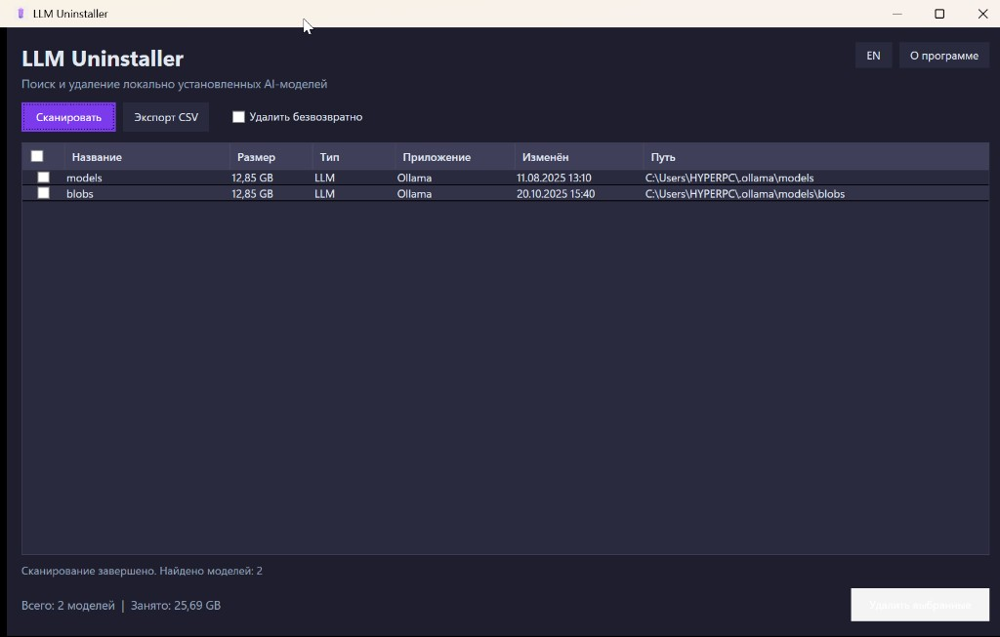

# LLM Uninstaller

[Russian version](README.md)

A Windows application that automatically discovers locally installed AI models (LLM, Embedding, Diffusion), shows disk space usage, and lets you safely delete selected models.



> **Built with [Cursor](https://cursor.com)** — this project was developed using the Cursor AI code editor.

## Features

- **Automatic discovery** in standard directories: Ollama, LM Studio, Hugging Face, GPT4All, Jan, ComfyUI, Text Generation WebUI, KoboldCpp, llama.cpp, Open WebUI
- **Additional disk scan** on C:, D:, E: drives
- **Classification** by type: LLM / Diffusion / Embedding
- **Safe deletion** — to Windows Recycle Bin (default) or permanent delete
- **Protected system paths** — Windows, Program Files, ProgramData require explicit confirmation
- **Logging** to SQLite (GUI) or JSON/SQLite (CLI)
- **CSV export**
- **Localization** — Russian / English
- **Auto-update** from [GitHub Releases](https://github.com/Marfa/LLM_Uninstaller/releases)

## Requirements

- Windows 10/11 (64-bit)
- **Framework-dependent** build requires [.NET 8 Desktop Runtime (x64)](https://aka.ms/dotnet/8.0/windowsdesktopruntime-x64)
- [.NET 8 SDK](https://dotnet.microsoft.com/download/dotnet/8.0) (for building from source)

## Download

Two variants are available in [Releases](https://github.com/Marfa/LLM_Uninstaller/releases):

| Variant | Size | .NET required | Files |
|---------|------|---------------|-------|
| **Portable** (self-contained) | ~70 MB | No | `LLMUninstaller.exe`, `llmuninstaller-cli.exe`, `LLMUninstaller-portable-win-x64.zip` |
| **Framework-dependent** | ~4 MB | [.NET 8 Desktop Runtime](https://aka.ms/dotnet/8.0/windowsdesktopruntime-x64) | `LLMUninstaller-framework.exe`, `llmuninstaller-cli-framework.exe`, `LLMUninstaller-framework-win-x64.zip` |

## Build from source

```powershell
git clone https://github.com/Marfa/LLM_Uninstaller.git
cd LLM_Uninstaller
dotnet build LLMUninstaller.sln -c Release
```

### Publish

**Portable** (no .NET runtime required on the PC):

```powershell
dotnet publish src\LLMUninstaller.Gui\LLMUninstaller.Gui.csproj -c Release -r win-x64 --self-contained -p:PublishSingleFile=true -p:EnableCompressionInSingleFile=true
dotnet publish src\LLMUninstaller.Cli\LLMUninstaller.Cli.csproj -c Release -r win-x64 --self-contained -p:PublishSingleFile=true -p:EnableCompressionInSingleFile=true
```

**Framework-dependent** (requires .NET 8 Desktop Runtime):

```powershell
dotnet publish src\LLMUninstaller.Gui\LLMUninstaller.Gui.csproj -c Release -r win-x64 --self-contained false -p:PublishSingleFile=true
dotnet publish src\LLMUninstaller.Cli\LLMUninstaller.Cli.csproj -c Release -r win-x64 --self-contained false -p:PublishSingleFile=true
```

## CLI usage

```powershell
llmuninstaller-cli [options]
```

| Option | Description |
|--------|-------------|
| `--export-csv <path>` | Export report to CSV |
| `--no-disk-scan` | Skip C:/D:/E: drive scan |
| `--drives C:,D:` | Specify drives to scan |
| `--json-log` | Log to JSON (default: SQLite) |
| `--log <path>` | Log file path |
| `--help` | Show help |

## Model detection rules

A directory is considered a model if it:

- contains a file **> 500 MB** with a supported extension, **or**
- has total size **> 1 GB**

### Supported extensions

| Type | Extensions |
|------|------------|
| LLM | `.gguf`, `.bin`, `.safetensors`, `.pth`, `.pt` |
| Diffusion | `.ckpt`, `.safetensors`, `.onnx` |
| Embedding | `.gguf`, `.bin`, `.safetensors` |

## Standard search paths

| Application | Path |
|-------------|------|
| Ollama | `%USERPROFILE%\.ollama\models` |
| LM Studio | `%USERPROFILE%\.lmstudio\models` |
| Hugging Face | `%USERPROFILE%\.cache\huggingface\hub` |
| GPT4All | `%LOCALAPPDATA%\nomic.ai\GPT4All` |
| Jan | `%APPDATA%\Jan\data\models` |
| ComfyUI | `*\ComfyUI\models` |
| Text Generation WebUI | `*\text-generation-webui\models` |
| KoboldCpp | `*\KoboldCpp\models` |
| llama.cpp | `*\llama.cpp\models` |
| Open WebUI | `%USERPROFILE%\open-webui` |

## Project structure

```
LLMUninstaller/
├── .github/workflows/   # automated release builds
├── docs/                  # screenshots and documentation
├── src/
│   ├── LLMUninstaller.Core/
│   ├── LLMUninstaller.Cli/
│   └── LLMUninstaller.Gui/
└── LLMUninstaller.sln
```

## Support

- Source code: [github.com/Marfa/LLM_Uninstaller](https://github.com/Marfa/LLM_Uninstaller)
- Donate: [donationalerts.com/r/themarfa](https://www.donationalerts.com/r/themarfa)
- Crypto: [nowpayments.io/donation/themarfa](https://nowpayments.io/donation/themarfa)

## License

This project is licensed under [Creative Commons Attribution-NonCommercial-ShareAlike 4.0 International (CC BY-NC-SA 4.0)](https://creativecommons.org/licenses/by-nc-sa/4.0/).

You may share and adapt the material for non-commercial purposes with attribution, and derivative works must be distributed under the same license.
